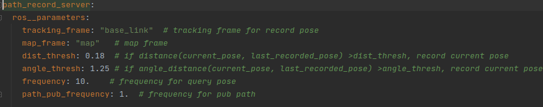

# Path Record Node

Recording path base on distance and angular motion filter, Steps for usage:

For compile please using command like: ```colcon build --pacakges-select path_record```

1. launch node:

```asm
ros2 launch path_record path_record.launch.py record_with_start:=True
```
2. Param please look at path_record.yaml in params folder

3. call service to start recording

```asm
ros2 service call /path_record_server/path_record path_record/srv/PathRecord "{ request_code: 0 }"
```

    request_code：   
        0： start record path  
        1： stop record path  
        2： reset record path  
        3： get record path   

4. pub topics

topic name: `recorded_path`   nav_msgs::msg::Path


topic name: `recorded_pose`    geometry_msgs::msg::PoseStamped